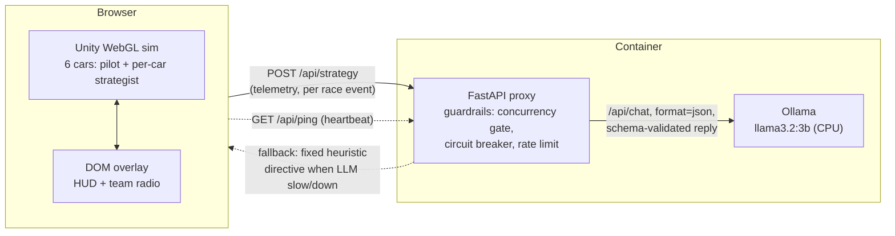

# Agentic Racing

Six mechanically identical cars race a closed circuit in the browser. Each car
is a two-tier agent: a pilot that maps observations to steering/throttle/brake,
and an event-driven LLM team boss that reads race telemetry and radios back a
high-level strategy — F1 team-radio style, live, on screen. The point of the
demo is to make that agentic pattern (perceive → reason → delegate) visible,
not to be a realistic racing sim.

Fully self-hosted: the strategist runs on a local `llama3.2:3b` served by a
bundled Ollama sidecar. There is no external LLM API and no API key — clone
it, build it, run it, and it works offline after the image is pulled.

## What it is

- **Pilot** — drives every frame. Reads local observations (track raycasts,
  own speed, heading vs. the racing line, lap progress) and outputs
  `[steering, throttle, brake]`. It never sees the standings or lap times —
  only its immediate surroundings and the directive currently in effect.
- **Team boss** — one independent LLM strategist *per car* (no shared brain).
  On a race event (lap completed, a rival closing in, a position change, an
  incident, the final lap) it gets a compact telemetry snapshot — standings,
  gaps, lap history, a short note log — and returns a directive: `attack /
  defend / conserve / push`, an aggression level, a risk tolerance, an optional
  target rival, and a short radio line. That directive is what the pilot
  conditions on; the strategist never touches the controls directly.
- The race **never waits** on the strategist. Calls are asynchronous with a
  per-car cooldown; until a reply lands (or if it never does) the car keeps
  its last directive. A fixed heuristic strategy takes over the moment the LLM
  is slow, off, or a reply fails validation — this is shown in the UI, not
  hidden.

The shipped build currently drives all six cars with a scripted heuristic
implementation of the pilot rather than a trained reinforcement-learning
policy — see [Limitations](#limitations) for why, and what's still in place
for training one.

## Architecture

The whole simulation — track, cars, pilots — runs client-side as a Unity
WebGL build. A small DOM overlay on top of the canvas renders the HUD and the
team-radio feed (Unity's own UI can't be styled with page CSS, so it stays out
of this entirely). The only thing that leaves the browser is one small JSON
POST per strategy call.



- **FastAPI app** — serves the static WebGL build (with the correct headers
  for Unity's pre-compressed `.br` assets) and proxies `POST /api/strategy` to
  the local model: it builds the prompt (a stable per-car prefix + the
  variable telemetry, so Ollama can reuse the KV-cache between calls), forces
  JSON output, validates the reply against a fixed schema, and discards it
  whole on any mismatch rather than trying to patch it. It is stateless — no
  race history is kept server-side.
- **Ollama sidecar** — `llama3.2:3b`, loopback-only, weights baked into the
  image so startup needs no network access.
- **Load guardrails**, all always on, because a single CPU-only model instance
  is shared by up to six strategists: a circuit breaker that falls back to the
  heuristic directive when latency or failures spike, a per-IP rate limit, a
  bounded output length, a global concurrency gate, and a cooldown per car so
  events don't queue up faster than the model can answer.

The app itself does not implement authentication or TLS — it's designed to
run behind a reverse proxy that terminates TLS and handles auth, so it stays
a plain, portable container.

## Prerequisites

- **To run it:** Docker only.
- **To build it from source:** Unity **6000.3.22f1** (Unity 6.3 LTS) with the
  *Web Build Support* module, to produce the WebGL player. Python isn't
  needed to build — it's only used at container runtime (installed by the
  Dockerfile).

## Build

The published image already contains a built WebGL player and the baked
model — see [Run](#run) if that's all you want.

To build the image from source, you need a WebGL player under `web/Build/`
and `web/TemplateData/` before `docker build` runs, because the Dockerfile
just copies `web/` as-is (Unity is a build-time dependency, not a runtime
one — there's no Unity or .NET inside the final image). Produce that player
either:

- **From the Unity Editor**: open `unity/`, then `File > Build Settings` with
  the `Assets/Scenes/Race.unity` scene, target WebGL, and build into
  `unity/Builds/`. Copy the resulting `Build/` and `TemplateData/` folders
  into `web/`.
- **Headless**, from the CLI:
  ```sh
  unity-editor -batchmode -quit -projectPath unity \
    -executeMethod AgenticRacing.EditorTools.Fase4RaceScene.BuildWebGL
  ```
  This also merges the output into `web/` for you.

Then build the image:

```sh
docker build -f docker/Dockerfile -t agentic-racing .
```

This is a two-stage build: it first installs Ollama and bakes the
`llama3.2:3b` weights into a layer, then copies only the CPU runtime (no
CUDA/ROCm/Vulkan) into the final ~4.5 GB image, of which about 2 GB is the
model itself.

## Run

```sh
docker run -p 8080:8080 ghcr.io/alulema/agentic-racing:latest
```

Then open `http://localhost:8080/`. First start takes a few seconds while the
sidecar loads the model.

For local development without rebuilding the image on every server change,
`compose.yaml` runs the FastAPI app and Ollama as two separate services (the
model lives in a Docker volume instead of an image layer):

```sh
docker compose up --build
```

## Environment variables

None are required — every one below has a working default.

| Variable | Default | Purpose |
|---|---|---|
| `OLLAMA_MODEL` | `llama3.2:3b` | Model served by the sidecar. |
| `OLLAMA_URL` | `http://127.0.0.1:11434` | Where the proxy reaches Ollama. |
| `OLLAMA_KEEP_ALIVE` | `24h` | How long Ollama keeps the model loaded between calls. Must be a duration string, not the bare `-1` — Ollama rejects that as a string. |
| `OLLAMA_NUM_THREAD` | `3` | CPU threads for inference. Leave one core free for the app itself — e.g. `3` on 4 vCPU, `1` on 2 vCPU. |
| `OLLAMA_NUM_PARALLEL` / `OLLAMA_MAX_LOADED_MODELS` | `1` / `1` | Kept at 1: the proxy already serialises calls, so extra Ollama-side parallelism just fights the app for CPU. |
| `STRATEGY_TIMEOUT_S` | `45` | Per-call timeout. On expiry the car keeps its current directive. |
| `STRATEGY_MAX_CONCURRENT` | `1` | Max strategy calls in flight at once. |
| `STRATEGY_BREAKER_P95_MS` / `STRATEGY_BREAKER_COOLDOWN_S` | `35000` / `60` | Circuit-breaker threshold and cooldown before retrying the LLM after it trips to the heuristic fallback. |
| `STATIC_DIR` | `/app/static` | Where the FastAPI app looks for the WebGL build. |
| `PROJECT_ID`, `DEMO_SLOT` | `unknown` | Free-form identifiers logged at startup and echoed in `/api/health`, for correlating a running container with whatever provisioned it. Purely informational — nothing in the app behaves differently based on them. |

## Usage

Query parameters on the page URL configure a race, e.g.
`http://localhost:8080/?seed=12345&laps=5`:

- `seed` — integer seed for the procedurally generated circuit layout.
- `laps` — number of laps.
- `race` — race index, used to rotate grid order and which cars get an LLM
  strategist vs. the fixed heuristic across repeated runs.
- `?mock=1` — skips the Unity build entirely and drives the DOM overlay from
  canned data, useful for iterating on the HUD/radio UI alone.

On screen: the standings card, a lap counter, the LLM status chip
(`online` / a fallback reason / `down`, with a rejected-reply rate), and the
team-radio feed — every strategist call that lands, including the ones the
proxy discarded or that timed out, so a quiet radio or a rejected call is
visible, not swept under the rug.

`GET /api/health` reports the same guardrail state as JSON, and `GET
/api/ping` is the heartbeat the page calls on a timer to keep a
short-lived hosting environment from tearing the container down mid-race
during a quiet stretch.

## Limitations

- **CPU-only inference.** The strategist's radio lags what's happening on
  track by several seconds — the race never blocks on it, but it's
  noticeable, especially on the first (cold) call.
- **A 3B model discards more replies than a larger one.** JSON that doesn't
  match the schema — a wrong enum, a missing field — is thrown away whole and
  the car keeps its previous directive; the rejection rate is shown in the
  status chip and typically ranges under 10%.
- **The shipped pilot is a scripted heuristic, not a trained policy.**
  Reinforcement-learning training didn't converge reliably on the
  procedurally generated tracks in the time available, so the project shipped
  a heuristic driver on one fixed circuit instead. The RL agent, its
  observation space (including the directive channels the strategist writes
  to), and the training configs are still in the repo — a policy trained
  later can be dropped in without touching the strategy layer.
- **One fixed circuit** in this build: a rounded-rectangle oval with four
  numbered corners. The procedural track generator (seed → closed-loop
  circuit with numbered corners) exists and has test coverage, but isn't the
  one wired up to the current pilot.
- **Ephemeral by design.** No database, no session storage — a fresh
  container starts with a clean slate, and nothing survives a restart.
